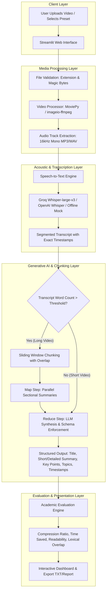

# ClipVid: AI-Based Video Summarization Using Generative AI

[](https://www.python.org/)
[](https://streamlit.io/)
[](https://github.com/openai/whisper)
[]()
[]()

> **Academic Mini-Project in Generative AI & Natural Language Processing**  
> An automated multimodal intelligence platform that converts lengthy video lectures, meetings, and tutorials into structured, executive-level summaries with timestamps, thematic topics, and quantifiable academic evaluation metrics.

---

## 1. Problem Statement

With the exponential surge of digital multimedia across platforms such as YouTube, Coursera, Zoom, and Microsoft Teams, students and professionals face severe **information overload**. Reviewing one-hour lecture recordings or meetings requires substantial time commitment, and manual note-taking is tedious, error-prone, and inconsistent.

Navigating to specific topical discussions inside an hour-long video is difficult without a structured, timestamped index. There is an urgent need for an automated, end-to-end system that digests spoken content, filters redundant filler phrases, and presents key insights rapidly.

---

## 2. Motivation

Traditional text summarization cannot be directly applied to video containers without multimodal preprocessing. By combining **digital signal processing (audio extraction via FFmpeg)**, **acoustic speech recognition (Whisper STT)**, and **state-of-the-art Generative AI (LLMs)**, we can transform raw video streams into actionable textual intelligence.

This project democratizes access to video content, empowering students to review hours of lecture recordings in minutes while preserving factual fidelity.

---

## 3. Project Objectives

1. **Multimodal Media Ingestion**: Accept common video formats (`.mp4`, `.mov`, `.avi`, `.mkv`, `.webm`) and validate container integrity.
2. **Audio Track Extraction**: Decouple audio streams from video containers and normalize them to 16kHz mono audio.
3. **Speech-to-Text Transcription**: Transcribe spoken dialogue into timestamped text segments using Whisper models.
4. **Hierarchical Map-Reduce Summarization**: Overcome LLM context window restrictions on long recordings using sentence-aware chunking and map-reduce synthesis.
5. **Multi-Faceted Synthesis**: Generate:
   - Suggested Title
   - Short Executive Summary (2-3 sentences)
   - Detailed Comprehensive Summary
   - Key Actionable Takeaways (bullet points)
   - Thematic Topic Badges
   - Important Video Sections & Timestamps
6. **Academic Evaluation**: Quantitatively evaluate generated summaries using compression ratios, reading time savings, lexical coverage, and Flesch reading ease scores.
7. **Export Capabilities**: Allow exporting transcripts, summaries, and full academic reports as `.txt`.

---

## 4. System Architecture & Workflow



---

## 5. Technologies Used & Design Rationale

| Component | Technology | Rationale |
| :--- | :--- | :--- |
| **Frontend Framework** | **Streamlit** | Rapid, reactive Python web UI; allows seamless progress tracking, audio/video playback, and instant parameter tuning. |
| **Media Processing** | **FFmpeg & MoviePy** (via `imageio-ffmpeg`) | Bundles standalone FFmpeg binaries without requiring manual system PATH installation on Windows/macOS/Linux. Robust across video formats. |
| **Speech-to-Text (STT)** | **Groq Whisper-large-v3** / **OpenAI Whisper** | World-class speech recognition accuracy, multi-lingual capabilities, and timestamp segment extraction. Groq provides near-instant inference (<2s). |
| **Generative AI / LLM** | **Llama-3.3-70b** (via Groq), **Google Gemini**, or **GPT-4o-mini** | State-of-the-art instruction following, high context comprehension, zero-shot structured JSON output, and anti-hallucination constraint adherence. |
| **Offline Fallback** | **Rule-based heuristic engine** | Guarantees that the project can be tested and demonstrated during college viva examinations even without internet access or API credits. |

> [!NOTE]
> **Academic Note on Generative AI**: This project employs external LLM APIs via prompt engineering and map-reduce orchestration. It **does NOT train a model from scratch**, which would require millions of parameters and massive GPU compute clusters impractical for a mini-project.

---

## 6. Directory Structure

```text
ClipVid/
├── app.py                      # Main Streamlit web application
├── requirements.txt            # Project dependencies
├── .env.example                # Template for environment variables and API keys
├── .env                        # Local configuration (git-ignored)
├── .gitignore                  # Git ignore rules for venv, temp, and outputs
├── README.md                   # Comprehensive academic project report
├── test_pipeline.py            # Automated test suite covering all modules
├── sample_videos/              # Sample test suite for viva demonstration
│   ├── create_samples.py       # Script to generate synthetic test media
│   ├── sample_education.mp4    # Valid video with audio tone
│   ├── sample_silent.mp4       # Video without audio (edge-case test)
│   ├── sample_corrupted.mp4    # Corrupted container (edge-case test)
│   └── sample_unsupported.xyz  # Unsupported extension (edge-case test)
├── modules/
│   ├── __init__.py             # Package initializer
│   ├── config.py               # Centralized configuration, thresholds, and keys
│   ├── utils.py                # Time formatting, file validation, report generator
│   ├── video_processor.py      # Video inspection, error handling, audio extraction
│   ├── transcription.py        # Pluggable STT providers (Groq, OpenAI, Offline)
│   ├── chunking.py             # Sentence-aware chunking & map-reduce partitioning
│   ├── summarizer.py           # LLM summarizers, JSON schema enforcement, anti-hallucination
│   └── evaluation.py           # Academic metrics (Flesch readability, compression, overlap)
├── outputs/                    # Saved reports and summaries
└── temp/                       # Ephemeral scratchpad for extracted audio (auto-cleaned)
```

---

## 7. Installation & Setup

### Step 1: Clone Repository & Create Virtual Environment

This project is tested and verified on **Python 3.11**.

```bash
# Clone the repository
git clone https://github.com/soham-raddi/ClipVid.git
cd ClipVid

# Create Python 3.11 virtual environment
py -3.11 -m venv .venv

# Activate virtual environment
# On Windows PowerShell:
.\.venv\Scripts\Activate.ps1
# On macOS/Linux:
source .venv/bin/activate
```

### Step 2: Install Dependencies

```bash
pip install -r requirements.txt
```

### Step 3: Configure Environment Variables

Copy `.env.example` to `.env`:

```bash
copy .env.example .env
```

Open `.env` and set your Groq API key:

```env
GROQ_API_KEY=your_groq_api_key_here
MAX_FILE_SIZE_MB=200
CHUNK_SIZE_WORDS=600
CHUNK_OVERLAP_WORDS=50
```

> [!TIP]
> **API Key Setup**: Get a free API key at [Groq Cloud Console](https://console.groq.com/). The key is securely loaded from `.env` and is never exposed in the browser.

> [!TIP]
> **Free API Keys**: Get a free, ultra-fast API key from [Groq Cloud Console](https://console.groq.com/). Alternatively, you can use the **Offline Demo Mode** in the sidebar, which requires **no API keys**!

---

## 8. How to Run the Application

```bash
streamlit run app.py
```

The application will launch in your default web browser at `http://localhost:8501`.

---

## 9. Academic Evaluation Component

To fulfill college mini-project grading criteria, ClipVid computes four quantitative metrics for every processed video:

| Metric | Calculation | Significance for Viva |
| :--- | :--- | :--- |
| **Compression Ratio (%)** | $(1 - \frac{\text{Summary Words}}{\text{Transcript Words}}) \times 100$ | Measures conciseness. A 70–85% reduction demonstrates effective condensation of lecture materials. |
| **Estimated Time Saved** | $\text{Speaking Time} (140\text{ wpm}) - \text{Reading Time} (220\text{ wpm})$ | Translates word reduction into concrete student productivity benefits. |
| **Lexical Coverage (%)** | $\frac{|\text{Summary Content Vocab} \cap \text{Transcript Vocab}|}{|\text{Transcript Content Vocab}|} \times 100$ | Quantifies how much salient subject matter vocabulary is captured. |
| **Flesch Reading Ease** | $206.835 - 1.015\left(\frac{\text{words}}{\text{sentences}}\right) - 84.6\left(\frac{\text{syllables}}{\text{words}}\right)$ | Quantifies readability. A score of 50–70 indicates clear, accessible prose. |
| **Factual Groundedness (%)** | $\frac{|\text{Summary Content Vocab} \cap \text{Transcript Vocab}|}{|\text{Summary Content Vocab}|} \times 100$ | Heuristic anti-hallucination metric measuring the proportion of summary vocabulary directly supported by the source transcript. |

---

## 10. Comprehensive Testing Strategy

ClipVid includes an automated test suite verifying edge cases and real-world inputs:

```bash
python test_pipeline.py
```

### Test Case Matrix:

| Test Case | Scenario | Expected Behavior |
| :--- | :--- | :--- |
| **TC-01** | Short educational video with clear speech | Transcribes accurately, produces all 6 summary sections. |
| **TC-02** | Extended transcript (>750 words) | Triggers map-reduce chunking with configurable overlap. |
| **TC-03** | Video with **no audio track** (`sample_silent.mp4`) | Gracefully catches `NoAudioTrackError`, alerts user politely. |
| **TC-04** | Corrupted media container (`sample_corrupted.mp4`) | Catches `CorruptedVideoError`, prevents application crash. |
| **TC-05** | Unsupported extension (`.xyz`) | Rejects file at validation phase with allowed format list. |
| **TC-06** | Network failure or missing API key | Recommends offline demo mode or displays API key prompt. |

---

## 11. Viva Voce & Presentation Q&A

**Q1: Why didn't you train your own LLM for this project?**  
*Answer:* Training an LLM from scratch requires petabytes of text, thousands of GPUs, and millions of dollars in compute. For practical domain applications, modern software engineering uses foundational models via APIs, focusing effort on data preprocessing, chunking pipelines, prompt engineering, and UI integration.

**Q2: How do you prevent the LLM from hallucinating?**  
*Answer:* We employ three techniques: (1) System prompt constraints instructing the model to rely *strictly* on transcript content; (2) Zero-shot structured JSON schemas preventing creative rambling; and (3) Groundedness heuristic metrics that flag unsupported vocabulary.

**Q3: How does the system handle an hour-long video that exceeds token limits?**  
*Answer:* We employ a **Map-Reduce chunking pipeline**. The transcript is divided into overlapping segment windows (e.g. 600 words with 50-word overlap). Each chunk is summarized independently (Map step), and the intermediate summaries are then synthesized into a final structured output (Reduce step).

**Q4: Why use 16kHz mono audio for transcription?**  
*Answer:* Speech recognition models like Whisper are trained on 16kHz mono audio. Converting stereo multi-channel high-bitrate audio to 16kHz mono eliminates redundant channels, reduces file size by up to 80%, speeds up network transfer, and matches acoustic model expectations.

---

## 12. Limitations & Future Work

### Limitations:
- **Audio Quality Dependence**: Heavily muffled background noise or overlapping speakers can degrade Whisper's transcript accuracy.
- **Visual Context**: The current implementation analyzes audio speech tracks; visual information (e.g., slides or whiteboard writing without speech) is not ingested.

### Future Work:
- **Vision-Language Model (VLM) Integration**: Incorporate GPT-4V or Gemini Pro Vision to extract text and diagrams from video keyframes.
- **Speaker Diarization**: Label individual speakers (e.g., "Professor", "Student A").
- **Direct YouTube Ingestion**: Add `pytube`/`yt-dlp` support for summarizing direct YouTube URLs without downloading local files.

---

## 13. License

This project is open-source under the [MIT License](LICENSE).
